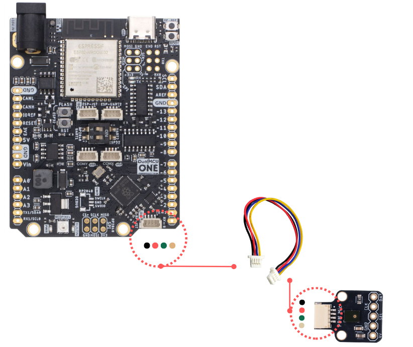
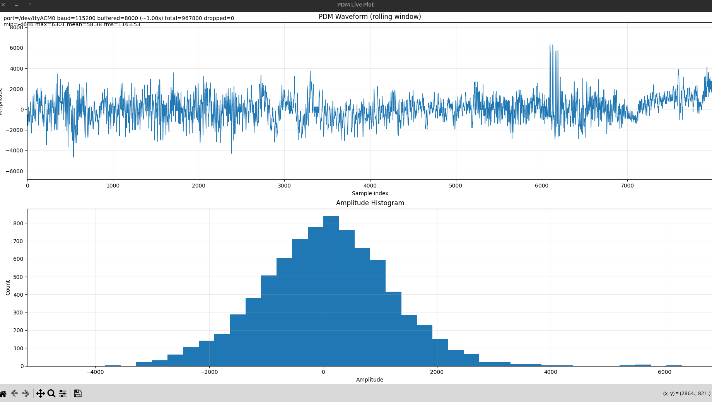

<div align="center">

<h1>Software &mdash; UNIT DevLab PDM MP34DT05TR Microphone</h1>

<p>
  Example code for the <strong>UNIT DevLab PDM MP34DT05TR Microphone Breakout</strong>,<br>
  a digital MEMS microphone based on the ST&nbsp;MP34DT05-A sensor.<br>
  Examples target the <strong>Raspberry Pi Pico&nbsp;/&nbsp;Pico&nbsp;2 (RP2040&nbsp;/&nbsp;RP2350)</strong> using the Arduino framework.
</p>


<br/>


</div>

---

## 📁 Folder structure

```
software/
└── cpp_examples/
    └── pdm_microphone/
        ├── pdm_microphone.ino      # Arduino sketch
        └── serial_live_samples.py  # Python live viewer / plotter
```

---

## ✅ Requirements

<details>
<summary><strong>Hardware</strong></summary>
<br>

| Item | Details |
|------|---------|
| Board | Raspberry Pi Pico or Pico 2 |
| UNIT DevLab PDM Mic | MP34DT05-A breakout |
| Cable | JST connector or breadboard wires |

</details>

<details>
<summary><strong>Software</strong></summary>
<br>

| Tool | Notes |
|------|-------|
| Arduino IDE | 2.x recommended |
| arduino-pico core | latest — earlephilhower |
| Python | 3.9 + |
| pyserial | `pip install pyserial` |
| matplotlib *(optional)* | `pip install matplotlib` |

</details>

---

## 📦 Available examples

| Example | Description |
|---------|-------------|
| [`cpp_examples/pdm_microphone`](cpp_examples/) | Capture PDM audio and stream PCM samples over Serial |

---

## 🚀 Quick start

1. Wire the microphone to the Pico — see the wiring table in [`cpp_examples/README.md`](cpp_examples/README.md).
2. Install the **arduino-pico** board package in Arduino IDE.
3. Open `cpp_examples/pdm_microphone/pdm_microphone.ino` and click **Upload**.
4. Open the Serial Monitor at **115 200 baud** — you should see signed integer samples printed one per line.
5. *(Optional)* Launch the Python live plotter:

```sh
python3 cpp_examples/pdm_microphone/serial_live_samples.py
```
